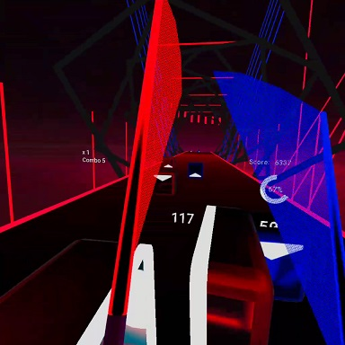
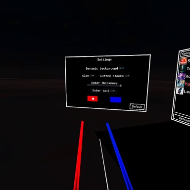
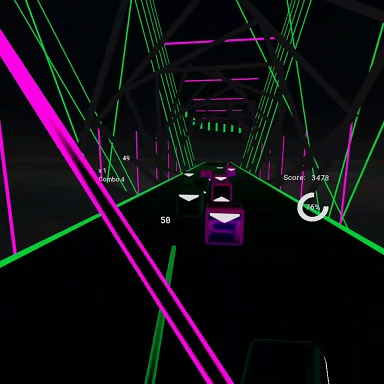

# Godot Beep Saber VR
This is a basic implementation of the beat saber game mechanic for VR using the [Godot Game Engine](https://godotengine.org/) and the [Godot Oculus Quest Toolkit](https://github.com/NeoSpark314/godot_oculus_quest_toolkit). The main objective of this project is to show how a VR game can be implemented using
the Godot game engine.

The main target platform is the Oculus Quest but it should also work with SteamVR if you add the OpenVR plugin to the addons folder in the godot project.

Originally this game was (and still is) a demo game as part of the Godot Oculus Quest Toolkit. To keep the demo implementation small
this stand alone version was forked so that it can be changed and developed independent of the original demo.

# About the implementation
This game uses godot 3.2. The implementation supports to load and play maps from [BeatSaver](https://beatsaver.com/).

There is one demo song included that is part of the deployed package.

You can play custom songs by either using the in-game menu or by downloading them manually and unpacking them and putting them into folders `BeepSaber/Songs/songNameXYZ` on your Oculus Quest.
To play custom songs on desktop VR you need to put them into a folder like `Downloads/BeepSaber/Songs/songNameXYZ`.

# Credits
The included Music Track is Time Lapse by TheFatRat (https://www.youtube.com/watch?v=3fxq7kqyWO8)

# Licensing
The source code of the godot beep saber game in this repository is licensed under an MIT License.